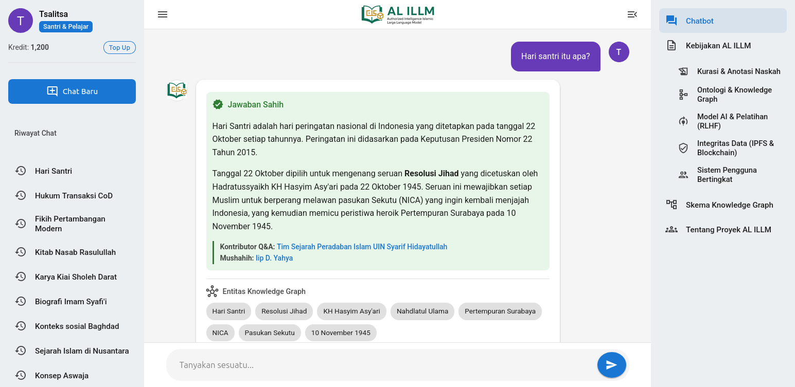

# Spesifikasi Fungsional & Panduan Interaksi UI AL 'ILLM



**Tujuan Dokumen:** Dokumen ini berfungsi sebagai panduan teknis bagi desainer UI/UX dan developer frontend untuk memahami, mereplikasi, dan mengembangkan fungsionalitas yang dirancang dalam mockup `index.html`.

**Filosofi Inti:** Setiap elemen dan interaksi bertujuan untuk mewujudkan tiga prinsip utama: **Otoritas yang Transparan**, **Eksplorasi Terpandu**, dan **Kejelasan Intuitif**.

**Pembaruan Terakhir:** Fungsionalitas telah diperbarui secara signifikan untuk menyertakan perilaku responsif dan interaksi berbasis modal. `index.html` kini merupakan file mandiri (*self-contained*) yang menyematkan semua CSS, JavaScript, dan konten teks yang diperlukan.

---

## 1. Struktur Layout & Komponen Utama

Aplikasi menggunakan layout tiga kolom yang fleksibel:
1.  **Sidebar Kiri (`.sidebar`):** Berisi profil pengguna, aksi utama, dan riwayat percakapan. Dapat diciutkan (*collapsible*).
2.  **Konten Utama (`.main-content`):** Area dinamis untuk menampilkan alur percakapan.
3.  **Sidebar Kanan (`.sidebar-right`):** Berisi menu navigasi utama untuk laman-laman proyek. Dapat diciutkan (*collapsible*).

### 1.1. Sidebar Kiri (`<aside class="sidebar" id="sidebar-left">`)

Sidebar kiri berfungsi sebagai pusat kontrol percakapan dan identitas pengguna. Terdiri dari dua zona fungsional utama.

- **Zona 1: Profil & Aksi Utama**
    - **Elemen:**
        1.  `profile-card`: Menampilkan avatar, nama, dan kelas pengguna.
        2.  `credits`: Menampilkan sisa kredit.
        3.  `new-chat-btn`: Tombol "Chat Baru".
    - **Spesifikasi Interaksi:**
        - **Klik `new-chat-btn`:** Membersihkan seluruh konten di area `.chat-messages` dan mempersiapkan state untuk percakapan baru. Riwayat chat sebelumnya harus diarsipkan.
        - **Tooltip:** Saat hover di atas tombol "Chat Baru", muncul tooltip "Mulai percakapan baru".

- **Zona 2: Riwayat Chat (`.chat-history`)**
    - **Elemen:** Daftar tautan percakapan sebelumnya.
    - **Spesifikasi Interaksi:**
        - **Klik Item Riwayat:** Memuat ulang seluruh state percakapan yang dipilih ke dalam area `.chat-messages`, termasuk semua pertanyaan pengguna dan jawaban bot yang terkait.
        - **Tooltip:** Setiap item riwayat memiliki tooltip yang mengklarifikasi aksinya (contoh: "Lanjutkan percakapan tentang 'Hari Santri'").

### 1.2. Sidebar Kanan (`<aside class="sidebar-right" id="sidebar-right">`)

Sidebar kanan didedikasikan untuk navigasi antar-laman utama proyek.

- **Elemen:** `.main-menu` yang berisi daftar tautan (`<a>`) pilar-pilar proyek.
- **Spesifikasi Interaksi:**
    - **Klik Item Menu:** **Membuka jendela modal** yang menampilkan konten penjelasan yang relevan. Konten ini disematkan langsung di dalam file `index.html` dari dokumen `esai-final.md`.
    - **Tooltip:** Setiap item menu memiliki tooltip yang menjelaskan halaman tujuan (contoh: "Jelajahi struktur data dan hubungan entitas" untuk menu Knowledge Graph).

### 1.3. Konten Utama (`<main class="main-content">`)

- **Elemen:** Terdiri dari `.chat-header` dan `.chat-container`.
- **Spesifikasi Interaksi:** Lebar area ini secara otomatis menyesuaikan saat salah satu atau kedua sidebar di-expand/collapse untuk mengisi ruang yang tersedia.

- **Header (`.chat-header`)**
    - **Elemen:** Dua tombol *toggle* dan logo.
    - **Spesifikasi Interaksi:**
        - **Klik `#menu-toggle-left`:** Memicu fungsi JavaScript untuk menambahkan/menghapus kelas `.collapsed` pada elemen `#sidebar-left`.
        - **Klik `#menu-toggle-right`:** Memicu fungsi JavaScript untuk menambahkan/menghapus kelas `.collapsed` pada elemen `#sidebar-right`.
        - **Tooltip:** Setiap tombol menu menampilkan tooltip yang sesuai ("Buka/Tutup Sidebar Kiri" dan "Buka/Tutup Menu Laman").

---

## 2. Alur & Mekanisme Percakapan (`.chat-messages`)

Ini adalah komponen paling dinamis dan krusial.

### 2.1. Kartu Respons Bot (`.message-content`)

Setiap jawaban dari bot harus berisi komponen-komponen berikut untuk memastikan transparansi dan fungsionalitas.

- **Status Jawaban (`.status-badge`)**
    - **Fungsi:** Indikator visual paling utama. Harus langsung terlihat. `Jawaban Sahih` untuk konten dari Q&A pairs tervalidasi; `Jawaban Belum Ditashih` untuk konten yang di-generate oleh model AI.

- **Metadata Jawaban (`.metadata`)**
    - **Elemen:** Menampilkan **Kontributor Q&A** dan **Mushahih**.
    - **Spesifikasi Interaksi:** Nama kontributor dan mushahih kini berupa **tautan yang dapat diklik**. Mengklik tautan ini akan **membuka jendela modal** yang menampilkan profil singkat dari individu atau lembaga tersebut.

- **Sumber Informasi (`.source-section`)**
    - **Elemen:** Terdiri dari dua sub-seksi: "Entitas Knowledge Graph" dan "Dokumen Teranotasi". Keduanya berisi elemen `.source-chip`.
    - **Spesifikasi Interaksi:**
        - **Klik `.source-chip`:** **Membuka jendela modal yang saat ini hanya menampilkan judul dari sumber tersebut sebagai placeholder.** Konten detail untuk setiap *chip* akan diimplementasikan di masa mendatang (lihat Daftar Tugas).
        - **Tooltip:** Setiap chip memiliki tooltip yang menjelaskan aksinya (contoh: "Lihat entitas 'Imam Syafi'i' dalam Knowledge Graph").

- **Penalaran & Umpan Balik (khusus `Jawaban Belum Ditashih`)**
    - **Elemen:**
        1.  `<details class="reasoning-section">`: Komponen *collapsible* (akordeon) yang berisi penjelasan langkah-langkah yang diambil model AI untuk menghasilkan jawaban.
        2.  `.feedback-section`: Kontainer untuk interaksi pengguna.
    - **Spesifikasi Interaksi:**
        - **Klik `summary` ("Cek Penalaran"):** Membuka atau menutup bagian penalaran.
        - **Klik Tombol Umpan Balik:** Tombol "Ya", "Tidak", dan "Laporkan" berfungsi sebagai titik interaksi bagi pengguna untuk memberikan masukan terhadap kualitas jawaban yang dihasilkan AI. Fungsionalitas pengiriman umpan balik ini akan diimplementasikan di masa mendatang.

### 2.2. Riset Lanjutan (`.research-suggestions`)

- **Fungsi:** Komponen proaktif untuk memandu pengguna.
- **Spesifikasi Interaksi:**
    - **Klik Pertanyaan:** Saat pengguna mengklik sebuah tautan pertanyaan di daftar ini, teks dari pertanyaan tersebut harus secara otomatis dikirim sebagai input pengguna baru, memicu giliran percakapan selanjutnya.

### 2.3. Input Pengguna (`.chat-input-area-wrapper`)

- **Elemen:** `input` field dan tombol kirim.
- **Spesifikasi Interaksi:**
    - **Klik Tombol Kirim:** Memicu pengiriman konten dari input field.
    - **Tooltip:** Hover di atas tombol kirim menampilkan "Kirim Pesan".

---

## 3. Perilaku Responsif

Aplikasi ini dirancang untuk menjadi *mobile-friendly* dengan logika sebagai berikut:

- **Layar Besar (Lebar > 992px):** Kedua sidebar (kiri dan kanan) akan terlihat secara default.
- **Layar Kecil (Lebar < 992px):** Kedua sidebar akan **otomatis diciutkan** (*collapsed*) saat halaman dimuat untuk memaksimalkan area konten.
- **Mekanisme "Push Content":** Di layar kecil, saat salah satu sidebar dibuka, ia akan **mendorong** konten utama ke samping, bukan menindihnya. Ini memastikan tombol *toggle* di header tetap terlihat dan dapat diakses oleh pengguna.

---

## 4. Fungsionalitas Modal

Setiap `.source-chip` di dalam aplikasi, serta item menu di sidebar kanan, kini bersifat interaktif. Saat diklik, sebuah jendela modal akan muncul, menampilkan konten yang relevan.

- **Konten Knowledge Graph:** Saat `.source-chip` diklik, modal akan menampilkan kartu profil detail untuk entitas yang dipilih. Konten ini dimuat secara dinamis dari objek `sourceChipContent` yang ada di `index.html`. Struktur data dan relasi di dalam objek ini secara ketat mematuhi `skema-knowledge-graph.md` untuk memastikan integritas data.

- **Konten Penjelasan Proyek:** Saat item menu di sidebar kanan (seperti "Kebijakan AL ILLM" atau "Alur Kerja Chatbot") diklik, modal akan menampilkan konten penjelasan yang sesuai dari objek `essayContent`. Konten ini mendukung format Markdown, termasuk rendering diagram alur kerja menggunakan pustaka Mermaid.js.

Fitur ini juga mendukung **penjelajahan rekursif**: mengklik tautan entitas lain di dalam modal akan memuat profil entitas baru tersebut di dalam modal yang sama, memungkinkan eksplorasi mendalam tanpa hambatan.

Selain itu, untuk entitas yang ditandai sebagai `tipe_entitas: "dokumen"`, sebuah tombol **"Tampilkan dokumen teranotasi"** akan muncul di bagian atas konten modal. Fitur ini memberikan akses langsung ke tampilan dokumen yang lebih mendalam.

**Contoh Implementasi untuk Chip "Hari Santri":**
-   **HTML:** `<a href="#" class="source-chip" data-chip-id="hari-santri">Hari Santri</a>`
-   **JavaScript (dalam `sourceChipContent`):**
    ```javascript
    "hari-santri": {
        nama_entitas: "Hari Santri",
        kategori_entitas: "Geopolitik dan Sejarah Dunia / Peristiwa Sejarah Dunia",
        deskripsi: "Hari peringatan nasional di Indonesia yang ditetapkan pada tanggal 22 Oktober setiap tahunnya, untuk mengenang seruan Resolusi Jihad yang dicetuskan oleh Hadratussyaikh KH Hasyim Asy'ari pada 22 Oktober 1945.",
        tokoh_kunci: ["kh-hasyim-asyari"],
        konteks_historis: ["resolusi-jihad", "pertempuran-surabaya"],
        dasar_hukum: ["keppres-no-22-tahun-2015"],
        kontributor: ["tim-sejarah-uin-jakarta"],
        validator: ["iip-d-yahya"],
        diperbarui: "1 Agustus 2025",
        referensi: ["keppres-no-22-tahun-2015"]
    }
    ```
-   **Output Modal (dihasilkan oleh `showModal`):**
    ```html
    <h4>Kategori Entitas</h4>
    <p>Geopolitik dan Sejarah Dunia / Peristiwa Sejarah Dunia</p>
    <h4>Deskripsi</h4>
    <p>Hari peringatan nasional di Indonesia yang ditetapkan pada tanggal 22 Oktober setiap tahunnya, untuk mengenang seruan Resolusi Jihad yang dicetuskan oleh Hadratussyaikh KH Hasyim Asy'ari pada 22 Oktober 1945.</p>
    <h4>Tokoh Kunci</h4>
    <ul>
        <li><a href="#" data-chip-id="kh-hasyim-asyari">KH Hasyim Asy'ari</a></li>
    </ul>
    <h4>Konteks Historis</h4>
    <ul>
        <li><a href="#" data-chip-id="resolusi-jihad">Resolusi Jihad</a></li>
        <li><a href="#" data-chip-id="pertempuran-surabaya">Pertempuran Surabaya</a></li>
    </ul>
    <h4>Dasar Hukum</h4>
    <ul>
        <li><a href="#" data-chip-id="keppres-no-22-tahun-2015">Keppres No. 22 Tahun 2015</a></li>
    </ul>
    <div class="metadata-box">
        <div class="metadata-row"><strong>Kontributor:</strong> <span><a href="#" data-contributor-id="tim-sejarah-uin-jakarta">Tim Sejarah Peradaban Islam UIN Syarif Hidayatullah</a></span></div>
        <div class="metadata-row"><strong>Validator:</strong> <span><a href="#" data-contributor-id="iip-d-yahya">Iip D. Yahya</a></span></div>
        <div class="metadata-row"><strong>Diperbarui:</strong> <span>1 Agustus 2025</span></div>
        <div class="metadata-row"><strong>Referensi:</strong> <span><a href="#" data-chip-id="keppres-no-22-tahun-2015">Keppres No. 22 Tahun 2015</a></span></div>
    </div>
    ```

Dengan mengikuti spesifikasi ini, tim pengembangan dapat membangun antarmuka yang fungsional dan setia pada visi konseptual proyek AL 'ILLM.

---

## 5. Rencana Pengembangan Mockup Dasbor Admin (`dasbor.html`)

Bagian ini menguraikan rencana pengembangan untuk mockup antarmuka pengguna (UI) Dasbor Admin. Tujuannya adalah untuk menciptakan sebuah file HTML mandiri (`dasbor.html`) yang secara visual merepresentasikan semua alur kerja dan komponen yang didefinisikan dalam `visi-fungsional-dasbor.md`. Mockup ini akan menjadi panduan visual bagi desainer dan developer.

### 5.1. Prinsip & Teknologi Dasar

- **File Mandiri:** Sama seperti `index.html`, `dasbor.html` akan menjadi file tunggal yang menyematkan semua CSS dan JavaScript yang diperlukan untuk interaktivitas dasar.
- **Framework CSS:** Akan menggunakan framework CSS modern dan ringan seperti Bootstrap 5 atau yang serupa untuk memastikan layout yang responsif dan komponen yang konsisten (tabel, formulir, modal, tombol).
- **Ikonografi:** Menggunakan pustaka ikon seperti Bootstrap Icons atau Font Awesome untuk memperjelas aksi dan status.
- **Fokus pada Visual, Bukan Logika:** Mockup ini tidak akan berisi logika backend. Semua data akan berupa *dummy data* (data contoh) yang disematkan langsung di HTML/JavaScript untuk mensimulasikan keadaan aplikasi yang nyata.

### 5.2. Struktur Halaman Utama

Struktur dasar dasbor akan terdiri dari:

1.  **Header Global:** Berisi logo, nama pengguna yang login, dan menu profil/logout.
2.  **Sidebar Navigasi Utama (Kiri):** Tautan utama untuk beralih antar modul:
    -   Dasbor Utama
    -   Pipeline Kurasi Dokumen
    -   Manajemen Knowledge Graph
    -   Tinjauan Umpan Balik
3.  **Area Konten Utama:** Area dinamis di mana konten dari modul yang dipilih akan ditampilkan.

### 5.3. Rencana Implementasi per Modul

#### 5.3.1. Modul Pipeline Kurasi Dokumen

- **Halaman Utama (Dasbor Pelacak Dokumen):**
    - Membuat tabel yang menampilkan daftar semua dokumen dalam pipeline.
    - Kolom: `Nama Dokumen`, `Status Saat Ini` (misal: `Proses Anotasi`), `Penanggung Jawab`, `Tanggal Diperbarui`.
    - Status akan menggunakan *badge* berwarna untuk identifikasi cepat.

- **Halaman Alur Kerja Digitalisasi:**
    - Membuat antarmuka *side-by-side*.
    - Sisi kiri: Placeholder untuk gambar pindaian dokumen.
    - Sisi kanan: Area `textarea` untuk transkripsi.
    - Di bawahnya: Panel untuk siklus review, menampilkan komentar dari *peer checker*.

- **Halaman Alur Kerja Anotasi:**
    - Menampilkan teks dari "Dokumen Sahih".
    - Mensimulasikan penyorotan teks. Saat teks disorot, sebuah jendela modal akan muncul.
    - Modal Anotasi: Berisi *dropdown* untuk memilih tipe entitas dan kolom pencarian *autocomplete* (disimulasikan) untuk menautkan ke entitas KG.

- **Halaman Alur Kerja Ekstraksi Q&A:**
    - Menampilkan teks dari "Dokumen Teranotasi".
    - Di sampingnya, menampilkan daftar Q&A pairs yang disarankan (sebagai *dummy data*).
    - Setiap Q&A pair akan memiliki tombol `Approve`, `Reject`, `Edit`.

#### 5.3.2. Modul Manajemen Knowledge Graph

- **Halaman Utama (Dasbor KG):**
    - Membuat *widget* atau kartu untuk "Antrean Permintaan Entitas".
    - Setiap item permintaan akan dapat diklik.

- **Halaman Editor Entitas:**
    - Membuat formulir yang komprehensif berdasarkan `skema-knowledge-graph.md`.
    - *Dropdown* untuk "Tipe Entitas" akan secara dinamis (disimulasikan dengan JavaScript) menampilkan/menyembunyikan kolom formulir yang relevan.
    - Kolom relasi akan menggunakan input teks biasa sebagai placeholder untuk fungsi *autocomplete*.

- **Halaman Penjelajah Graf (Opsional untuk Mockup Awal):**
    - Jika memungkinkan, membuat visualisasi graf sederhana menggunakan pustaka seperti Mermaid.js atau D3.js untuk beberapa entitas contoh. Jika terlalu kompleks, cukup sediakan placeholder halaman.

#### 5.3.3. Modul Tinjauan Umpan Balik

- **Halaman Utama (Inbox Umpan Balik):**
    - Membuat antarmuka seperti *inbox* email.
    - Setiap baris mewakili satu umpan balik, menampilkan penggalan pertanyaan pengguna dan jenis umpan baliknya (misal: ikon jempol ke bawah).
    - Mengklik satu baris akan membuka tampilan detail.

- **Halaman Detail Umpan Balik:**
    - Menampilkan detail lengkap: Pertanyaan, Jawaban Bot, Komentar Pengguna.
    - Di bawahnya, ada bagian "Tindakan" dengan tombol-tombol seperti `Buat Tugas Perbaikan Q&A` dan `Arsipkan`.
