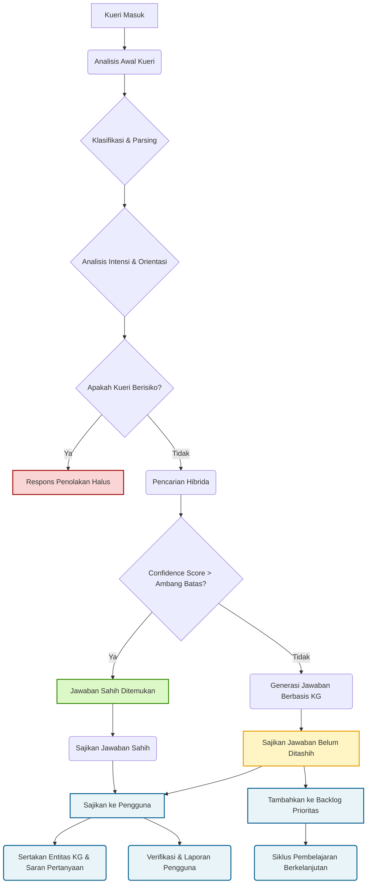

# Panduan Alur Kerja Chatbot AL ILLM & Sistem Validasi Pengetahuan

Dokumen ini menjelaskan alur kerja terperinci dari AI chatbot, mulai dari penerimaan kueri pengguna hingga penyajian respons.

Dokumen ini mencakup proses, algoritma, dan fitur-fitur spesifik, bertujuan untuk memberikan pemahaman yang jelas bagi tim developer, tim dataset, dan seluruh pemangku kepentingan.

-----

## Diagram Alur Kerja

-----

## 1. Tahap Analisis Awal Kueri

Ini adalah tahap pertama ketika kueri pengguna masuk. Fokusnya adalah memahami konteks dan tujuan kueri secara mendalam.

### 1.1. Klasifikasi Pengguna & Parsing Kategori
  
Model AI melakukan klasifikasi untuk mengidentifikasi **kelas pengguna** (umum, santri/pelajar, mahasantri/mahasiswa, ulama/akademisi) dan **kategori kueri** (pertanyaan murni, pertanyaan menguji, permohonan bantuan, dst.).

### 1.2. Analisis Intensi & Orientasi

Kueri dievaluasi apakah **intensi dan orientasinya** bertentangan dengan prinsip-prinsip Islam, khususnya *Aswaja An-Nahdliyyah*.

#### (-) Jika kueri dinilai berisiko

Kueri akan dijawab dengan **respons penolakan halus**, menyarankan konsultasi dengan ulama atau ahli yang kompeten. Alur kerja selesai.

#### (+) Jika dinilai aman

Kueri dilanjutkan ke tahap pencarian jawaban (poin 2).

-----

## 2. Tahap Pencarian Jawaban Sahih dengan *Hybrid Search*

Pada tahap ini, sistem berupaya mencari jawaban yang sudah divalidasi dari database Q&A dengan efisiensi dan akurasi maksimal.

### 2.1. *Hybrid Search*

Model menerapkan pencarian kata kunci tradisional dan pencarian semantik (misalnya, *cosine similarity*) sekaligus.

Kombinasi ini memastikan bahwa jawaban yang ditemukan relevan secara makna dan juga mengandung terminologi penting yang spesifik.

### 2.2. Penilaian *Confidence Score*

Setiap hasil pencarian akan diberi **skor kepercayaan (*confidence score*)**.

### (+) Jika skor tinggi (di atas ambang batas)

Sistem menganggap jawaban sahih ditemukan. Respons akan diambil langsung dari database Q&A.

### (-) Jika skor rendah

Sistem tidak menemukan jawaban sahih yang memadai dan akan melanjutkan ke tahap generasi jawaban.

-----

## 3. Tahap Generasi Jawaban Berbasis Pengetahuan

Jika jawaban sahih tidak ditemukan, sistem akan menyusun respons berdasarkan data terstruktur.

### 3.1. Pencarian di *Knowledge Graph*

Model akan menelusuri **graph database** yang memuat ontologi dan epistemologi (27 entitas utama seperti ulama, karya, mazhab, dst.) untuk menemukan jalur penentuan jawaban yang paling relevan.

Model juga menelusuri teks di dalam dokumen teranotasi yang tersimpan di dalam entitas karya (kitab, buku).

### 3.2. Proses Sintesis Jawaban

Model akan mempertimbangkan semua variabel yang ada (kelas pengguna, intensi, data dari Knowledge Graph) untuk menyusun jawaban.

Untuk meningkatkan akurasi dan mengurangi risiko halusinasi, model akan diminta untuk **menghasilkan kerangka (*outline*) jawaban** atau ***reasoning process*** terlebih dahulu sebelum menyusun teks lengkap.

### 3.3. Jawaban Belum Ditashih

Jawaban yang dihasilkan akan disajikan kepada pengguna, namun dengan status yang berbeda.

-----

## 4. Tahap Penyajian Respons dan Interaksi Pengguna (UX Lanjutan)

Respons disajikan kepada pengguna, baik yang sahih maupun yang belum ditashih, dengan fitur-fitur pendukung untuk transparansi dan eksplorasi.

### 4.1. Respons Sahih

Jawaban dari database Q&A ditampilkan dengan menyertakan nama **kontributor dan mushahih** (validator) untuk menjamin keabsahan.

### 4.2. Respons Belum Ditashih

Jawaban yang disusun oleh model ditampilkan dengan **disclaimer tegas** bahwa jawaban ini **belum sahih**.

Jawaban hasil generasi model ini juga melampirkan *reasoning process* dengan label **Penalaran** demi transparansi dan pertanggungjawaban sistem *explainable AI*.

### 4.3. Entitas *Knowledge Graph*

Di setiap jawaban (baik sahih maupun yang belum ditashih), disertakan **daftar entitas Knowledge Graph** yang relevan dan dapat diklik.

Hal ini memungkinkan pengguna untuk melihat detail entitas dan relasinya dengan entitas lain, demi memfasilitasi pembelajaran mandiri.

### 4.4. Personalisasi Saran Pertanyaan Lanjutan

Sistem akan memberikan **5 saran pertanyaan lanjutan** yang diambil dari database Q&A sahih dengan label **Riset Lanjutan**. Pemilihan pertanyaan ini disesuaikan dengan **kelas pengguna** (umum, santri, dll.) agar relevan dengan tingkat pengetahuan mereka.

### 4.5. Mekanisme Verifikasi & Laporan Pengguna

Untuk tiap jawaban yang belum ditashih, disertakan fitur bagi pengguna untuk memberikan masukan singkat terhadap jawaban (misalnya, Apakah jawaban ini relevan? [Ya] / [Tidak]) atau **melaporkan jawaban** yang dianggap bermasalah.

-----

## 5. Tahap Siklus Pembelajaran & Validasi (*Continuous Learning*)

Ini adalah mekanisme vital untuk memastikan sistem terus berkembang dan menjadi lebih baik dari waktu ke waktu.

### 5.1. Prioritas Otomatis *Backlog*

Setiap pertanyaan dan jawaban yang belum ditashih akan otomatis masuk ke **backlog** sebagai tugas baru tim kontributor dan mushahih Q&A.

Sistem akan memberikan **prioritas otomatis** pada backlog berdasarkan faktor: **relevansi jawaban**, **kelas pengguna** (yang bertanya dan memberikan *feedback*), dan **frekuensi pertanyaan yang sama**.

### 5.2. Siklus Pembelajaran Berkelanjutan (*Continuous Learning Loop*)

Tim **kontributor** dan **mushahih** bertugas untuk mengedit, memvalidasi, dan menyetujui jawaban di backlog.

Data hasil validasi ini tidak hanya dimasukkan ke database Q&A sahih, tetapi juga secara berkala digunakan untuk **melatih ulang (*fine-tuning*)** model generatif.

Siklus ini memastikan jawaban yang dihasilkan model di masa mendatang akan semakin akurat, sejalan dengan prinsip-prinsip yang dianut, dan meringankan beban kerja tim.
