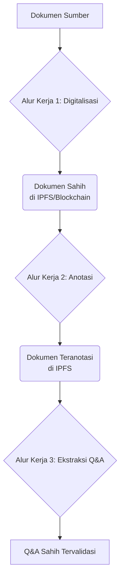
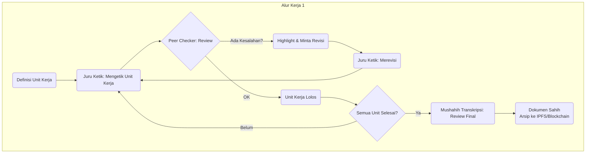
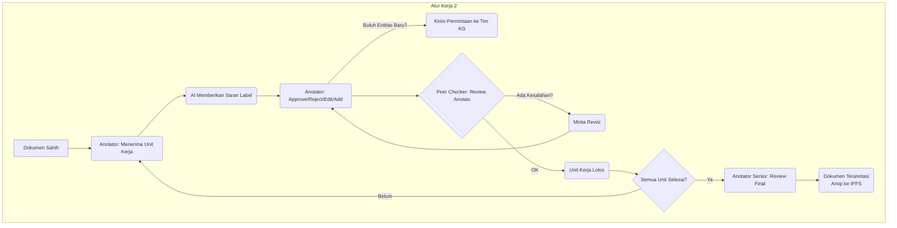
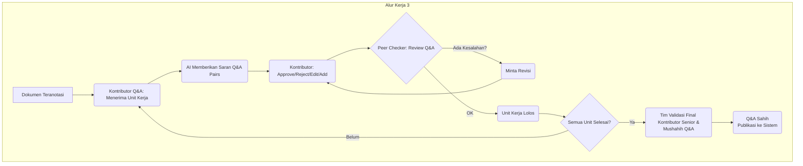
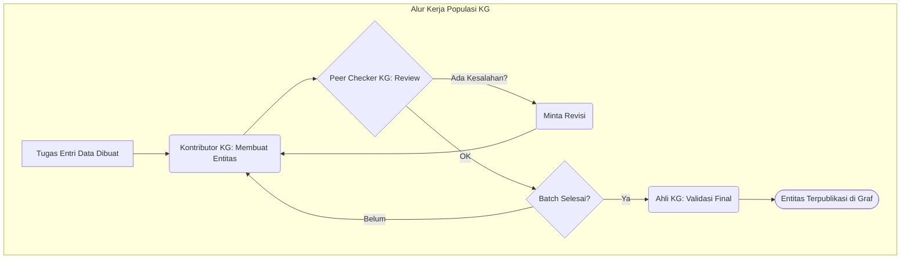
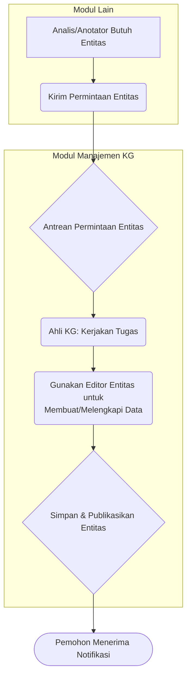
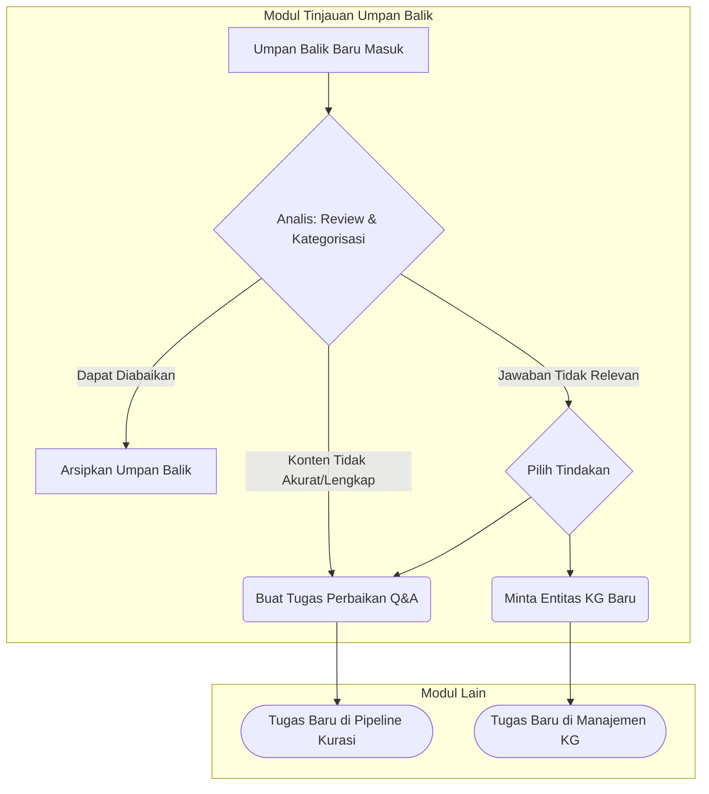

# Visi Fungsional: Dasbor Kolaboratif AL 'ILLM

Dokumen ini mendefinisikan arsitektur dan visi fungsional untuk **Dasbor Admin AL 'ILLM**. Dasbor ini adalah sebuah platform berbasis web yang dirancang sebagai ekosistem kolaboratif untuk mengelola seluruh siklus hidup konten, dari sumber mentah hingga menjadi data yang tervalidasi dan siap pakai.

---

## 1. Arsitektur & Prinsip Desain

### 1.1. Arsitektur Berbasis Modul
Dasbor dirancang dengan arsitektur modular, di mana setiap fungsi utama dipisahkan ke dalam modul-modul yang saling terhubung. Pendekatan ini memastikan kejelasan, skalabilitas, dan kemudahan pengelolaan.

### 1.2. Peran Pengguna & Kontrol Akses (RBAC)
Sistem ini beroperasi berdasarkan prinsip **Role-Based Access Control (RBAC)** yang fundamental. Setiap pengguna akan diberi satu atau lebih peran (misal: Juru Ketik, Anotator, Ahli KG, Mushahih) oleh admin sistem. Peran ini secara otomatis menentukan modul, data, dan tindakan apa saja yang dapat diakses oleh pengguna, menciptakan antarmuka yang fokus dan aman.

### 1.3. Konsep Inti: Unit Kerja Semantik (Semantic Chunk)
Untuk mengakomodasi beragam jenis dokumen, alur kerja menggunakan konsep **"Unit Kerja Semantik"**—potongan konten yang logis (bisa berupa bab, sub-bab, atau paragraf). Unit-unit ini didefinisikan dalam satu langkah persiapan awal dan digunakan secara konsisten di seluruh pipeline untuk memfasilitasi kerja paralel.

---

## 2. Diagram Gambaran Umum Pipeline Kurasi

Diagram ini menunjukkan keseluruhan proses dalam Modul Pipeline Kurasi Dokumen.

---

## 3. Modul-Modul Utama Dasbor

### 3.1. Modul Pipeline Kurasi Dokumen

Ini adalah modul inti dari "pabrik konten". Modul ini memfasilitasi alur kerja dari dokumen mentah hingga menjadi Q&A tervalidasi. Akses ke berbagai tahap di dalamnya dikelola melalui **Dasbor Pelacak Dokumen** terpusat, yang menunjukkan status setiap dokumen dan mengarahkan pengguna ke antarmuka yang relevan sesuai peran mereka.

Modul ini terbagi menjadi tiga sub-alur kerja yang berurutan:

#### 3.1.1. Alur Kerja 1: Digitalisasi & Validasi Teks

- **Tujuan:** Menghasilkan transkripsi teks digital ("Dokumen Sahih") yang 100% akurat dari dokumen sumber.
- **Input:** Pindaian dokumen sumber (misal: PDF, JPG).
- **Output:** Sebuah **"Dokumen Sahih"** yang disimpan di IPFS dengan jejak audit di blockchain.
- **Peran:** Juru Ketik, Peer Checker (Juru Ketik), Mushahih Transkripsi.
- **Langkah-langkah di Dasbor:**
    1.  **Persiapan:** Dokumen dibagi menjadi unit-unit kerja semantik oleh manajer proyek.
    2.  **Transkripsi per Unit Kerja:** Juru Ketik mengetik konten untuk unit kerja yang ditugaskan kepadanya dalam antarmuka *side-by-side*.
    3.  **Siklus Peer Review:** Hasil ketikan satu unit kerja diperiksa oleh Juru Ketik lain, yang menandai (highlights) potensi kesalahan untuk direvisi oleh pengetik asli.
    4.  **Integrasi & Validasi Final:** Setelah semua unit kerja dalam satu dokumen selesai dan lolos peer review, **Mushahih Transkripsi** memeriksa keseluruhan dokumen untuk memastikan tidak ada kesalahan ketik.
    5.  **Arsip "Dokumen Sahih":** Setelah disetujui, teks bersih disimpan sebagai versi final di IPFS & Blockchain.

#### 3.1.2. Alur Kerja 2: Anotasi & Pengayaan Semantik

- **Tujuan:** Memperkaya "Dokumen Sahih" dengan menghubungkannya ke Knowledge Graph, menghasilkan "Dokumen Teranotasi".
- **Input:** "Dokumen Sahih" dari Alur Kerja 1.
- **Output:** Sebuah **"Dokumen Teranotasi"** yang disimpan sebagai artefak baru.
- **Peran:** Anotator, Peer Checker (Anotator), Anotator Senior.
- **Langkah-langkah di Dasbor:**
    1.  **Anotasi per Unit Kerja:** Anotator menerima unit kerja yang sama yang telah didefinisikan sebelumnya. Sistem memberikan **saran label/tag entitas (suggested labels)** untuk unit kerja tersebut.
    2.  **Proses Anotasi:** Anotator melakukan **approve, reject, edit, atau menambah** anotasi baru, dan dapat menggunakan fitur **"Minta Entitas Baru"** untuk mengirim permintaan ke tim KG.
    3.  **Siklus Peer Review:** Sesama anotator saling memeriksa hasil anotasi per unit kerja dan meminta revisi.
    4.  **Review Final:** Setelah semua unit kerja teranotasi, **Anotator Senior** memeriksa konsistensi dan kualitas anotasi di seluruh dokumen.
    5.  **Arsip "Dokumen Teranotasi":** Versi yang diperkaya ini disimpan sebagai artefak baru.

#### 3.1.3. Alur Kerja 3: Ekstraksi & Validasi Q&A

- **Tujuan:** Menghasilkan daftar tanya-jawab yang akurat dan relevan ("Q&A Sahih") dari dokumen yang sudah teranotasi.
- **Input:** "Dokumen Teranotasi" dari Alur Kerja 2.
- **Output:** Daftar **"Q&A Sahih"** yang siap digunakan oleh chatbot.
- **Peran:** Kontributor Q&A, Peer Checker (Kontributor Q&A), Tim Validasi Final (Kontributor Q&A Senior & Mushahih Q&A).
- **Langkah-langkah di Dasbor:**
    1.  **Penyusunan per Unit Kerja:** Kontributor Q&A menerima unit kerja yang sama. Sistem memberikan **saran Q&A pairs** untuk unit kerja tersebut.
    2.  **Proses Penyusunan:** Kontributor melakukan **approve, reject, edit, atau menambah** pasangan Q&A baru.
    3.  **Siklus Peer Review:** Sesama kontributor saling memeriksa hasil kerja per unit kerja dan meminta revisi.
    4.  **Validasi Final Kolaboratif:** Setelah semua unit kerja selesai, daftar Q&A dari seluruh dokumen ditinjau oleh tim final yang terdiri dari **Kontributor Q&A Senior** (fokus pada kualitas dan relevansi) dan **Mushahih Q&A** (fokus pada kebenaran/kesahihan).
    5.  **Publikasi "Q&A Sahih":** Daftar final yang telah disetujui bersama ini dipublikasikan ke dalam sistem.

### 3.2. Modul Manajemen Knowledge Graph

Modul ini adalah pusat kendali untuk membangun, mengelola, dan menjelajahi basis pengetahuan. Modul ini melayani dua fungsi utama yang berjalan paralel: **(1) Alur Kerja Populasi Graf** secara proaktif oleh tim internal, dan **(2) Alur Kerja Permintaan Entitas** yang bersifat reaktif dari modul lain.

- **Tujuan:** Mengisi Knowledge Graph dengan entitas dan hubungan yang akurat dan tervalidasi, serta menanggapi kebutuhan entitas dari tim lain secara efisien.
- **Peran Utama:** Kontributor KG (misal: Mahasiswa), Peer Checker KG, Ahli KG (Validator Senior).

#### Komponen Inti
- **Dasbor KG:** Halaman utama yang menampilkan antrean kerja untuk kedua alur kerja (populasi dan permintaan).
- **Penjelajah Graf (Graph Explorer):** Kanvas visual interaktif untuk menjelajahi entitas dan hubungannya.
- **Editor Entitas (Schema-Driven Form):** Formulir cerdas yang dipandu oleh `skema-knowledge-graph.md` untuk memastikan entri data yang valid.

--- 

#### 3.2.1. Alur Kerja Proaktif: Populasi Knowledge Graph

Ini adalah alur kerja utama untuk mengisi KG dari nol, mengikuti proses kurasi tiga lapis.

- **Langkah 1: Entri Data (Kontributor KG):**
    - Bekerja berdasarkan daftar tugas yang diberikan (misal: "Masukkan 50 tokoh dari kitab X").
    - Menggunakan **Editor Entitas** untuk membuat entitas satu per satu.
    - Dapat membuat **"entitas rintisan" (stub entity)** sebagai placeholder untuk hubungan yang entitasnya belum dibuat.
    - Mengirimkan *batch* entitas untuk di-review.

- **Langkah 2: Peer Review (Peer Checker KG):**
    - Memeriksa *batch* entitas yang dikirim oleh rekannya berdasarkan sumber referensi.
    - **Menandai (highlights)** potensi kesalahan dan meminta revisi, bukan mengedit langsung.
    - Siklus revisi berlanjut hingga *batch* disetujui.

- **Langkah 3: Validasi Final (Ahli KG):**
    - Memeriksa *batch* yang sudah lolos peer review untuk akurasi dan konsistensi final.
    - Memiliki wewenang untuk melakukan koreksi akhir.
    - Mempublikasikan entitas ke dalam graf utama, membuatnya tersedia untuk semua modul lain.

--- 

#### 3.2.2. Alur Kerja Reaktif: Penanganan Permintaan Entitas

Ini adalah alur kerja yang lebih singkat untuk menanggapi kebutuhan mendesak dari tim kurasi dokumen.

- **Langkah 1: Menerima Permintaan:** Permintaan dari modul lain muncul di **Dasbor KG**.
- **Langkah 2: Pengerjaan oleh Ahli KG:** Seorang **Ahli KG** mengambil tugas tersebut. Karena ini adalah jalur cepat, proses peer review dilewati.
- **Langkah 3: Pembuatan & Notifikasi:** Ahli KG menggunakan **Editor Entitas** untuk membuat entitas yang diminta. Setelah disimpan dan dipublikasikan, notifikasi secara otomatis dikirim kembali ke pemohon asli untuk memberitahukan bahwa entitas tersebut telah tersedia.

---

#### 3.2.3. Alur Kerja Pemeliharaan & Jaminan Kualitas Jangka Panjang

Untuk menjaga agar Knowledge Graph tetap akurat, bersih, dan relevan seiring waktu, diperlukan alur kerja pemeliharaan yang berkelanjutan.

- **Manajemen Siklus Hidup Entitas:**
    - **Alur Kerja Pembaruan:** Perubahan signifikan pada sebuah entitas (misal: mengubah relasi kunci) harus memicu siklus validasi mini yang memerlukan persetujuan dari seorang **Ahli KG** sebelum dipublikasikan.
    - **Fitur Penggabungan Duplikat:** Antarmuka khusus untuk **Ahli KG** yang memungkinkan mereka memilih entitas duplikat, menunjuk satu sebagai entitas utama (kanonikal), dan secara otomatis memetakan ulang semua hubungan sebelum menghapus duplikatnya.
    - **Proses Deprekasi/Pengarsipan:** Entitas yang terbukti salah atau tidak relevan tidak dihapus (untuk menjaga integritas tautan lama), melainkan diberi status **"Diarsipkan"**. Entitas ini tidak akan muncul lagi dalam pencarian untuk anotasi baru.

- **Jaminan Kualitas Skala Besar:**
    - **Laporan Konsistensi Graf:** Dasbor akan secara periodik menjalankan skrip untuk mencari potensi anomali (misal: tokoh yang hidup di dua abad berbeda, peristiwa yang terjadi sebelum tokoh kuncinya lahir). Laporan ini akan disajikan kepada **Ahli KG** untuk ditinjau secara manual.

- **Evolusi Skema:**
    - **Versioning Skema:** Perubahan besar pada `skema-knowledge-graph.md` (misal: menambah properti wajib baru) harus direncanakan dengan matang. Proses ini harus mencakup strategi **migrasi data** untuk memperbarui semua entitas yang ada agar sesuai dengan skema versi terbaru.

### 3.3. Modul Tinjauan Umpan Balik Pengguna

Modul ini berfungsi untuk mengubah masukan pasif dari pengguna menjadi tugas perbaikan konten yang aktif dan dapat dilacak. Tujuannya adalah untuk secara sistematis menutup celah dalam basis pengetahuan berdasarkan pengalaman pengguna nyata.

- **Input:** Umpan balik dari pengguna akhir (termasuk pertanyaan, jawaban bot, jenis umpan balik, dan komentar).
- **Output:** Tugas-tugas baru yang dapat ditindaklanjuti di dalam modul lain (Pipeline Kurasi atau Manajemen KG), atau umpan balik yang diarsipkan.
- **Peran:** Analis Umpan Balik (atau Manajer Komunitas).

#### Alur Kerja Triase & Tindak Lanjut

1.  **Antrean Umpan Balik:** Semua umpan balik baru masuk ke dalam antarmuka *inbox* dengan status `Baru`.
2.  **Triase & Kategorisasi:** Seorang **Analis Umpan Balik** meninjau setiap item dan memberinya kategori, seperti:
    -   `Konten Tidak Akurat`
    -   `Konten Tidak Lengkap`
    -   `Jawaban Tidak Relevan`
    -   `Dapat Diabaikan` (misal: spam)
3.  **Tindak Lanjut (Action Loop):** Berdasarkan kategori, analis mengambil tindakan:
    -   Untuk `Konten Tidak Akurat` atau `Tidak Lengkap`, analis menggunakan tombol **"Buat Tugas Perbaikan Q&A"**.
    -   Untuk `Jawaban Tidak Relevan`, analis dapat memilih antara **"Buat Tugas Perbaikan Q&A"** atau **"Minta Entitas KG Baru"**.
    -   Untuk `Dapat Diabaikan`, analis mengklik **"Arsipkan"**.
4.  **Pelacakan Status:** Status umpan balik diperbarui secara otomatis menjadi `Sudah Ditindaklanjuti` atau `Diarsipkan`, membersihkan antrean dan memastikan semua item tertangani.

#### Siklus Penutupan Umpan Balik: Integrasi dengan Pipeline Kurasi

Ketika seorang Analis Umpan Balik mengklik **"Buat Tugas Perbaikan Q&A"**, sistem tidak hanya mengirim notifikasi, tetapi memulai alur kerja terintegrasi untuk memastikan kualitas:

1.  **Pembuatan Tugas Otomatis di Pipeline Kurasi:** Sebuah tugas baru secara otomatis dibuat di **Alur Kerja 3: Ekstraksi & Validasi Q&A**. Tugas ini langsung diisi dengan konteks relevan: pertanyaan pengguna, jawaban bermasalah, dan tautan ke dokumen sumber. Status awalnya adalah `Butuh Revisi (dari Umpan Balik)`.
2.  **Penugasan & Revisi:** Tugas ini muncul di antrean kerja **Kontributor Q&A**. Kontributor yang ditugaskan akan membuka tugas, melihat semua konteks, dan melakukan perbaikan pada Q&A pair yang salah.
3.  **Masuk Kembali ke Alur Validasi Standar:** Ini adalah titik integrasi kunci. Q&A yang telah direvisi **tidak langsung dipublikasikan**. Sebaliknya, ia harus melewati siklus validasi normal dari Alur Kerja 3: *Peer Review* oleh sesama kontributor, diikuti oleh validasi dari *Tim Validasi Final* (Kontributor Senior & Mushahih).
4.  **Publikasi & Penutupan Siklus:** Hanya setelah lolos semua lapisan validasi, Q&A yang diperbaiki akan dipublikasikan. Pada saat yang sama, status tiket umpan balik asli di Modul Tinjauan Umpan Balik secara otomatis diperbarui menjadi `Selesai & Terpublikasi`, menutup siklus sepenuhnya dan memastikan setiap umpan balik yang ditindaklanjuti telah melalui proses kontrol kualitas yang sama.